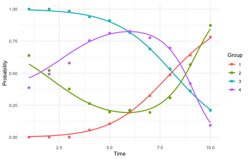

# Getting started with gbtmkit

`gbtmkit` turns group-based trajectory modeling (GBTM) into a
reproducible pipeline that follows the GRoLTS reporting checklist.
Estimation is delegated to interchangeable backends behind one
interface, so the same workflow handles binary and continuous outcomes,
and the fit diagnostics (entropy, APPA, OCC, group proportions) are
computed the same way regardless of engine.

``` r

library(gbtmkit)
```

## The data

The package ships two entirely synthetic datasets with known
ground-truth groups. `sim_binary` has a binary outcome measured on ten
occasions, with four latent trajectory shapes of mixed polynomial order:
a linear rising group, a cubic rise-peak-decline group, a cubic
decline-trough-recovery group, and a linear falling group:

``` r

data("sim_binary", package = "gbtmkit")
head(sim_binary)
#>   id      x1   x2 y1 y2 y3 y4 y5 y6 y7 y8 y9 y10 t1 t2 t3 t4 t5 t6 t7 t8 t9 t10
#> 1  1  0.4618 3.01  1  1  1  1  1  1  1  1  0   1  1  2  3  4  5  6  7  8  9  10
#> 2  2  0.0972 2.49  0  0  0  0  0  1  1  1  1   1  1  2  3  4  5  6  7  8  9  10
#> 3  3  0.6760 2.28  1  1  1  1  1  1  1  0  0   0  1  2  3  4  5  6  7  8  9  10
#> 4  4 -0.7488 2.08  0  0  0  0  0  0  1  1  1   0  1  2  3  4  5  6  7  8  9  10
#> 5  5  1.0256 4.63  0  1  1  0  0  0  0  0  1   1  1  2  3  4  5  6  7  8  9  10
#> 6  6 -0.6966 4.24  1  1  1  1  1  1  1  0  1   0  1  2  3  4  5  6  7  8  9  10
#>   true_group
#> 1          2
#> 2          1
#> 3          2
#> 4          1
#> 5          3
#> 6          4
```

## 1. Describe the model with a spec

[`gbtm_spec()`](https://fabregithub.github.io/gbtmkit/reference/gbtm_spec.md)
records *what* to model – the outcome and time columns (by name), the
id, and the outcome family – and validates it, independent of which
engine will fit it.

``` r

spec <- gbtm_spec(
  sim_binary,
  outcomes = paste0("y", 1:10),
  time     = paste0("t", 1:10),
  id       = "id",
  family   = "binomial"
)
spec
#> <gbtm_spec>
#>   family     : binomial
#>   subjects   : 1500
#>   occasions  : 10
#>   outcomes   : y1, y2, y3, y4, y5, y6, y7, y8, y9, y10
#>   time       : t1, t2, t3, t4, t5, t6, t7, t8, t9, t10
#>   id         : id
```

## 2. Run the whole pipeline in one call

[`run_gbtm_pipeline()`](https://fabregithub.github.io/gbtmkit/reference/run_gbtm_pipeline.md)
performs algorithm selection (when the engine offers a choice),
group-number selection, the polynomial-shape search with GRoLTS
acceptance criteria, and the final Hessian-on fit. Here we use a small
search to keep the vignette quick.

``` r

res <- run_gbtm_pipeline(
  spec,
  candidates = 2:5,     # consider 2 to 5 groups
  degree     = 2,       # quadratic while choosing the number of groups --
                        # with curved shapes, linear-only selection under-selects
  method     = "L",     # fix the algorithm (skip stage 1) for speed
  max_degree = 3,       # allow up to cubic in the shape search
  seed       = 1,
  verbose    = FALSE
)
res
#> <gbtm_result>
#>   engine/family : trajeR / binomial
#>   method        : L
#>   groups        : 4
#>   degrees       : 2, 3, 1, 3
#>   GRoLTS criteria met: TRUE
#>   entropy       : 0.762  BIC: 17116.7
```

The pipeline recovers the four planted groups. Everything each stage
produced is kept on the result object:

``` r

res$group_selection      # BIC for each candidate number of groups
#> <gbtm_selection> stage=n_groups  by=BIC
#>  n_groups   degrees      bic      aic   ok
#>         2       2,2 17422.92 17385.72 TRUE
#>         3     2,2,2 17452.17 17393.73 TRUE
#>         4   2,2,2,2 17168.99 17089.29 TRUE
#>         5 2,2,2,2,2 17197.93 17096.98 TRUE
#>   best: 4
```

``` r

summary(res)
#> === gbtm pipeline result ===
#> <gbtm_result>
#>   engine/family : trajeR / binomial
#>   method        : L
#>   groups        : 4
#>   degrees       : 2, 3, 1, 3
#>   GRoLTS criteria met: TRUE
#>   entropy       : 0.762  BIC: 17116.7
#> 
#> Group diagnostics:
#>  group n_assigned prop_assigned prop_model mismatch  appa    occ
#>      1        325         0.217      0.197   -0.019 0.862 25.333
#>      2        290         0.193      0.217    0.023 0.902 33.189
#>      3        572         0.381      0.358   -0.023 0.891 14.634
#>      4        313         0.209      0.228    0.019 0.866 21.945
#> 
#> Assigned group sizes:
#> 
#>   1   2   3   4 
#> 325 290 572 313
```

## 3. Inspect and plot

[`gbtm_diagnostics()`](https://fabregithub.github.io/gbtmkit/reference/gbtm_diagnostics.md)
gives the GRoLTS classification diagnostics, and
[`plot_trajectories()`](https://fabregithub.github.io/gbtmkit/reference/plot_trajectories.md)
draws the fitted group trajectories with the observed per-group means
overlaid.

``` r

res$diagnostics$groups
#>   group n_assigned prop_assigned prop_model    mismatch      appa      occ
#> 1     1        325     0.2166667  0.1973879 -0.01927876 0.8616925 25.33329
#> 2     2        290     0.1933333  0.2166825  0.02334920 0.9017755 33.18889
#> 3     3        572     0.3813333  0.3583779 -0.02295544 0.8909961 14.63429
#> 4     4        313     0.2086667  0.2275517  0.01888500 0.8660335 21.94462
```

``` r

plot_trajectories(res$final_fit)
```



plot of chunk unnamed-chunk-8

Per-subject group assignment (the analogue of exporting a group column)
is in `res$assignment`:

``` r

head(res$assignment)
#>   id group           p1           p2           p3           p4
#> 1  1     3 7.128253e-10 4.486503e-04 9.472586e-01 0.0522927836
#> 2  2     1 9.470205e-01 4.553914e-02 3.593663e-08 0.0074403597
#> 3  3     3 6.537871e-11 5.160593e-05 9.423786e-01 0.0575698258
#> 4  4     1 9.602393e-01 2.927954e-02 2.435747e-08 0.0104811684
#> 5  5     2 3.073100e-03 9.962652e-01 1.342337e-05 0.0006482664
#> 6  6     3 2.151267e-10 1.157310e-04 9.264874e-01 0.0733968257
```

## 4. Or run the stages individually

[`run_gbtm_pipeline()`](https://fabregithub.github.io/gbtmkit/reference/run_gbtm_pipeline.md)
is a convenience wrapper. For full control you can run each GRoLTS stage
yourself and inspect the result before moving on – this is exactly what
the wrapper does internally.

**Stage 1 – choose the estimation algorithm.** trajeR offers `"L"`,
`"EM"` and `"EMIRLS"`; the one with the lowest BIC is selected. (Engines
with a single optimizer skip this stage.)

``` r

algo <- select_algorithm(spec, n_groups = 2, degrees = c(1, 1))
algo
#> <gbtm_selection> stage=algorithm  by=BIC
#>  method       bic       aic   ok
#>       L  17980.01  17953.44 TRUE
#>      EM 145507.87 145481.30 TRUE
#>  EMIRLS 145739.37 145712.80 TRUE
#>   best: L
```

**Stage 2 – choose the number of groups** by BIC over a set of
candidates. Quadratic shapes are used while sweeping: with curved
trajectories like these, linear-only selection under-selects the number
of groups:

``` r

groups <- select_n_groups(spec, candidates = 2:5, degree = 2, method = "L")
groups
#> <gbtm_selection> stage=n_groups  by=BIC
#>  n_groups   degrees      bic      aic   ok
#>         2       2,2 17422.92 17385.72 TRUE
#>         3     2,2,2 17452.17 17393.73 TRUE
#>         4   2,2,2,2 17168.99 17089.29 TRUE
#>         5 2,2,2,2,2 17197.93 17096.98 TRUE
#>   best: 4
```

**Stage 3 – search polynomial shapes** for the chosen number of groups,
then apply the GRoLTS acceptance criteria (PMS \> 0.05, APPA \> 0.70,
OCC \>= 5). (The one-call pipeline above searched up to cubic; here we
cap the search at quadratic to keep the vignette quick.)

``` r

shapes <- evaluate_shapes(spec, n_groups = groups$best, method = "L",
                          max_degree = 2, verbose = FALSE)
apply_grolts_criteria(shapes)
#> <gbtm_criteria> PMS>0.05, APPA>0.70, OCC>=5 | 5 shape(s) pass
#>   recommended: degrees 2,2,1,1  (BIC 17157.6, entropy 0.751)
```

**Stage 4 – fit the final model** (Hessian on, so the fit carries
standard errors) and read off the diagnostics and per-subject
assignment. Here we use the lowest-BIC shape found by the search:

``` r

fit <- fit_gbtm(spec, n_groups = groups$best, degrees = shapes$best, method = "L")
gbtm_diagnostics(fit)
#> <gbtm_diagnostics> groups=4  n=1500  entropy=0.751
#>   BIC=17157.64  AIC=17088.56  logLik=-8531.28
#>  group n_assigned prop_assigned prop_model mismatch  appa    occ
#>      1        292         0.195      0.220    0.026 0.872 24.154
#>      2        290         0.193      0.207    0.014 0.867 24.913
#>      3        582         0.388      0.366   -0.022 0.894 14.680
#>      4        336         0.224      0.207   -0.017 0.869 25.385
head(gbtm_assign(fit))
#>   id group          p1           p2           p3           p4
#> 1  1     3 0.068521677 4.383472e-04 9.310400e-01 3.874436e-09
#> 2  2     4 0.006976607 5.761473e-02 4.597202e-08 9.354086e-01
#> 3  3     3 0.055095198 6.591163e-05 9.448389e-01 3.652009e-10
#> 4  4     4 0.006236484 5.497547e-02 3.255112e-08 9.387880e-01
#> 5  5     2 0.003693904 9.832119e-01 2.924786e-05 1.306498e-02
#> 6  6     3 0.068865474 1.503810e-04 9.309841e-01 1.180727e-09
```

## Continuous outcomes

The same pipeline handles continuous outcomes: switch the family to
`"gaussian"` (mapped to a censored-normal model) and point the spec at a
continuous dataset. `sim_continuous` has the same four shape types on a
continuous scale.

We fit cubic shapes in all four groups (in a real analysis the shape
search refines the per-group degrees, as above). Shape misspecification
can push a fit into a degenerate local optimum where a group ends up
empty – on this data, forcing *linear* shapes (`degrees = rep(1, 4)`)
with the `"L"` optimizer does exactly that. If it happens,
[`plot_trajectories()`](https://fabregithub.github.io/gbtmkit/reference/plot_trajectories.md)
/
[`gbtm_predict()`](https://fabregithub.github.io/gbtmkit/reference/gbtm_predict.md)
warn you; switching the method (`"EM"` recovers all four groups here) or
revisiting the shapes fixes it.

``` r

data("sim_continuous", package = "gbtmkit")
cspec <- gbtm_spec(
  sim_continuous,
  outcomes = paste0("y", 1:10),
  time     = paste0("t", 1:10),
  id       = "id",
  family   = "gaussian"
)
cfit <- fit_gbtm(cspec, n_groups = 4, degrees = rep(3, 4), method = "L")
gbtm_diagnostics(cfit)$entropy
#> [1] 1
```

[`plot_trajectories()`](https://fabregithub.github.io/gbtmkit/reference/plot_trajectories.md)
works the same way; for a continuous outcome the fitted lines and the
observed points are on the outcome’s own scale (means, not
probabilities):

``` r

plot_trajectories(cfit)
```


plot of chunk unnamed-chunk-15

## Choosing an engine

Everything above used the default engine, `trajeR`. Estimation is
pluggable: every fitting function
([`gbtm_fit()`](https://fabregithub.github.io/gbtmkit/reference/gbtm_fit.md),
the stage functions, and
[`run_gbtm_pipeline()`](https://fabregithub.github.io/gbtmkit/reference/run_gbtm_pipeline.md))
takes an `engine` argument, and the registry tells you what each backend
offers:

``` r

gbtm_engines()
#> [1] "trajeR"  "flexmix" "lcmm"
sapply(gbtm_engines(), gbtm_engine_families)
#> $trajeR
#> [1] "binomial" "gaussian" "poisson"  "beta"    
#> 
#> $flexmix
#> [1] "binomial" "gaussian" "poisson" 
#> 
#> $lcmm
#> [1] "binomial" "gaussian"
sapply(gbtm_engines(), gbtm_engine_per_group_degrees)
#>  trajeR flexmix    lcmm 
#>    TRUE   FALSE   FALSE
```

The three backends make different trade-offs:

|  | `trajeR` (default) | `flexmix` | `lcmm` |
|----|----|----|----|
| Families | binomial, gaussian, poisson, beta | binomial, gaussian, poisson | binomial, gaussian |
| Optimizers | `"L"`, `"EM"`, `"EMIRLS"` (stage 1 picks one) | EM (fixed) | Marquardt (fixed) |
| Per-group degrees | yes | no – one order for all groups | no – one order for all groups |
| Notes | reference GBTM implementation | fast EM on large data | `hlme()`; binary via a thresholds link |

The pipeline adapts automatically: for a single-optimizer engine stage 1
is skipped, and for a uniform-degree engine the stage-3 shape search
sweeps uniform shapes (degree 1 for all groups, degree 2 for all groups,
…) instead of per-group combinations.

Switching engine is one argument – here the same 4-group cubic model on
the binary data with each backend:

``` r

fits <- list(
  trajeR  = fit_gbtm(spec, engine = "trajeR",  n_groups = 4,
                     degrees = rep(3, 4), method = "L", hessian = FALSE),
  flexmix = fit_gbtm(spec, engine = "flexmix", n_groups = 4,
                     degrees = rep(3, 4), seed = 1),
  lcmm    = fit_gbtm(spec, engine = "lcmm",    n_groups = 4,
                     degrees = rep(3, 4), seed = 1)
)
sapply(fits, function(f) {
  d <- gbtm_diagnostics(f)
  c(entropy = round(d$entropy, 3), min_appa = round(min(d$groups$appa), 3))
})
#>          trajeR flexmix  lcmm
#> entropy   0.761   0.749 0.750
#> min_appa  0.851   0.846 0.844
```

All three engines find the same four groups with comparable
classification quality. One caution: **compare BIC within an engine,
never across engines** – each backend defines its likelihood differently
(lcmm’s thresholds link even fits a different model family), so their
absolute BIC values are not on a common scale. Use BIC to pick the
number of groups and shape *given* an engine; use the classification
diagnostics (entropy, APPA, OCC) to sanity-check a fit from any engine.

## Notes

- **Engine-agnostic by design.** The pipeline talks only to a small set
  of accessors
  ([`gbtm_bic()`](https://fabregithub.github.io/gbtmkit/reference/gbtm_accessors.md),
  [`gbtm_posterior()`](https://fabregithub.github.io/gbtmkit/reference/gbtm_accessors.md),
  [`gbtm_group_sizes()`](https://fabregithub.github.io/gbtmkit/reference/gbtm_accessors.md),
  …), so additional backends can be added without changing the workflow.
- **Built to scale.** The shape search runs the fits with the Hessian
  off (needed only for the final model’s standard errors), defaults to a
  greedy stepwise strategy, and supports a `time_budget`, `max_fits`,
  and on-disk `checkpoint`ing so large problems run unattended and
  bounded. \`\`\`
