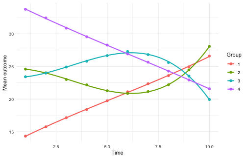

<!-- vignettes/getting-started.Rmd is GENERATED from getting-started.Rmd.orig
     by data-raw/precompile-vignette.R: edit the .orig and re-run that script;
     do not edit the generated file. -->


`gbtmkit` turns group-based trajectory modelling (GBTM) into a reproducible
pipeline that follows the GRoLTS reporting checklist. Estimation is delegated
to interchangeable backends -- a built-in native engine (`"gbtmkit"`, the
default) and the established `trajeR`, `flexmix`, and `lcmm` packages --
behind one interface: every fitting function takes an `engine` argument, and
the fit diagnostics (entropy, APPA, OCC, group proportions) are computed the
same way regardless of engine, for binary and continuous outcomes alike.

The examples below all use the default native engine; the
[Choosing an engine](#choosing-an-engine) section at the end compares and
benchmarks the backends and shows how to switch. Along the way we turn the
finished result into a GRoLTS reporting aid (`grolts_report()`), escape a
local optimum with multi-start initialisation (`n_starts`), and predict group
membership from covariates (`gbtm_spec(covariates = ...)`).


``` r
library(gbtmkit)
```

## The data

The package ships two entirely synthetic datasets with known ground-truth
groups. `sim_binary` has a binary outcome measured on ten occasions, with four
latent trajectory shapes of mixed polynomial order: a linear rising group, a
cubic rise-peak-decline group, a cubic decline-trough-recovery group, and a
linear falling group:


``` r
data("sim_binary", package = "gbtmkit")
head(sim_binary)
#>   id      x1   x2 y1 y2 y3 y4 y5 y6 y7 y8 y9 y10 t1 t2 t3 t4 t5 t6 t7 t8 t9 t10
#> 1  1  0.4618 3.01  1  1  1  1  1  1  1  1  0   1  1  2  3  4  5  6  7  8  9  10
#> 2  2  0.0972 2.49  0  0  0  0  0  1  1  1  1   1  1  2  3  4  5  6  7  8  9  10
#> 3  3  0.6760 2.28  1  1  1  1  1  1  1  0  0   0  1  2  3  4  5  6  7  8  9  10
#> 4  4 -0.7488 2.08  0  0  0  0  0  0  1  1  1   0  1  2  3  4  5  6  7  8  9  10
#> 5  5  1.0256 4.63  0  1  1  0  0  0  0  0  1   1  1  2  3  4  5  6  7  8  9  10
#> 6  6 -0.6966 4.24  1  1  1  1  1  1  1  0  1   0  1  2  3  4  5  6  7  8  9  10
#>   true_group
#> 1          2
#> 2          1
#> 3          2
#> 4          1
#> 5          3
#> 6          4
```

## Describe the model with a spec

`gbtm_spec()` records *what* to model -- the outcome and time columns (by name),
the id, and the outcome family -- and validates it, independent of which engine
will fit it.


``` r
spec <- gbtm_spec(
  sim_binary,
  outcomes = paste0("y", 1:10),
  time     = paste0("t", 1:10),
  id       = "id",
  family   = "binomial"
)
spec
#> <gbtm_spec>
#>   family     : binomial
#>   subjects   : 1500
#>   occasions  : 10
#>   outcomes   : y1, y2, y3, y4, y5, y6, y7, y8, y9, y10
#>   time       : t1, t2, t3, t4, t5, t6, t7, t8, t9, t10
#>   id         : id
```

## Run the whole pipeline in one call

`run_gbtm_pipeline()` performs algorithm selection (when the engine offers a
choice), group-number selection, the polynomial-shape search with GRoLTS
acceptance criteria, and the final Hessian-on fit. Here we use a small search to
keep the vignette quick.


``` r
res <- run_gbtm_pipeline(
  spec,
  candidates = 2:5,     # consider 2 to 5 groups
  degree     = 2,       # quadratic while choosing the number of groups --
                        # with curved shapes, linear-only selection under-selects
  max_degree = 3,       # allow up to cubic in the shape search
  seed       = 1,
  verbose    = FALSE
)
res
#> <gbtm_result>
#>   engine/family : gbtmkit / binomial
#>   method        : EM
#>   groups        : 4
#>   degrees       : 1, 3, 3, 1
#>   GRoLTS criteria met: TRUE
#>   entropy       : 0.759  BIC: 17109.9
```

The pipeline recovers the four planted groups. Everything each stage produced is
kept on the result object:


``` r
res$group_selection      # BIC for each candidate number of groups
#> <gbtm_selection> stage=n_groups  by=BIC
#>  n_groups   degrees      bic      aic   ok
#>         2       2,2 17422.92 17385.72 TRUE
#>         3     2,2,2 17275.74 17217.30 TRUE
#>         4   2,2,2,2 17168.93 17089.23 TRUE
#>         5 2,2,2,2,2 17194.21 17093.26 TRUE
#>   best: 4
```


``` r
summary(res)
#> === gbtm pipeline result ===
#> <gbtm_result>
#>   engine/family : gbtmkit / binomial
#>   method        : EM
#>   groups        : 4
#>   degrees       : 1, 3, 3, 1
#>   GRoLTS criteria met: TRUE
#>   entropy       : 0.759  BIC: 17109.9
#> 
#> Group diagnostics:
#>  group n_assigned prop_assigned prop_model mismatch  appa    occ
#>      1        333         0.222      0.204   -0.018 0.866 25.207
#>      2        284         0.189      0.210    0.021 0.893 31.457
#>      3        313         0.209      0.228    0.020 0.867 22.108
#>      4        570         0.380      0.357   -0.023 0.891 14.738
#> 
#> Assigned group sizes:
#> 
#>   1   2   3   4 
#> 333 284 313 570
```

## Inspect and plot

`gbtm_diagnostics()` gives the GRoLTS classification diagnostics, and
`plot_trajectories()` draws the fitted group trajectories with the observed
per-group means overlaid.


``` r
res$diagnostics$groups
#>   group n_assigned prop_assigned prop_model    mismatch      appa      occ
#> 1     1        333     0.2220000  0.2038646 -0.01813543 0.8658558 25.20687
#> 2     2        284     0.1893333  0.2102101  0.02087676 0.8933063 31.45717
#> 3     3        313     0.2086667  0.2284620  0.01979536 0.8674872 22.10796
#> 4     4        570     0.3800000  0.3574633 -0.02253669 0.8912919 14.73752
```


``` r
plot_trajectories(res$final_fit)
```

<div class="figure">

<p class="caption">plot of chunk unnamed-chunk-8</p>
</div>

Per-subject group assignment (the analogue of exporting a group column) is in
`res$assignment`:


``` r
head(res$assignment)
#>   id group           p1           p2          p3           p4
#> 1  1     4 3.265315e-09 4.611098e-04 0.052880054 9.466588e-01
#> 2  2     1 9.496915e-01 4.249617e-02 0.007812277 3.560491e-08
#> 3  3     4 2.927023e-10 5.356235e-05 0.057881482 9.420650e-01
#> 4  4     1 9.596223e-01 2.885852e-02 0.011519114 2.528171e-08
#> 5  5     2 6.759531e-03 9.925507e-01 0.000676577 1.323316e-05
#> 6  6     4 9.585742e-10 1.193279e-04 0.073931256 9.259494e-01
```

## Report against the GRoLTS checklist

`grolts_report()` maps the finished pipeline result onto the GRoLTS checklist
(van de Schoot et al. 2017): items the pipeline can answer -- time metric,
software, the shape search, starting values, selection tools, class sizes,
entropy -- are filled in automatically, and items only you can know (the
missing-data mechanism, what appears in the manuscript, syntax availability)
are flagged with whatever context the result contributes. Pass `file =` to
also write the report as a Markdown appendix for supplementary material.


``` r
grolts_report(res)
#> <gbtm_grolts_report> GRoLTS reporting aid (items paraphrased from
#>   van de Schoot et al. 2017, doi:10.1080/10705511.2016.1247646)
#> 
#> -- auto-filled from the pipeline result --
#>   [1] Metric of time
#>       10 occasions (columns t1 .. t10); observed times span [1, 10].
#>   [2] Time within waves
#>       Fixed occasions: every subject shares the same times (1, 2, 3, 4, 5,
#>       6, 7, 8, 9, 10); within-wave variance is 0.
#>   [4] Observed outcome distribution
#>       Per-wave proportions: 0.59, 0.58, 0.57, 0.58, 0.58, 0.57, 0.53, 0.51,
#>       0.47, 0.44.
#>   [5] Software
#>       R version 4.6.1 (2026-06-24); gbtmkit 0.3.0.9000; engine gbtmkit
#>       (gbtmkit 0.3.0.9000), method 'EM'.
#>   [7] Alternative trajectory shapes
#>       17 polynomial shapes fitted (stepwise search, degrees 1..3 per
#>       group); chosen degrees: 1, 3, 3, 1.
#>   [8] Covariates
#>       No covariates were used.
#>   [9] Starting values / iterations
#>       Final fit: single (default) initialisation; iteration cap 100. (This
#>       engine's default initialisation is deterministic; additional starts
#>       are k-means partitions.)
#>   [10] Model selection tools
#>       Group number selected by BIC over 2..5 groups; shapes screened with
#>       GRoLTS acceptance criteria (min class share > 0.05, APPA > 0.7, OCC
#>       >= 5).
#>   [11] Number of models fitted
#>       24 models fitted in total (2 algorithm comparison, 4 group-number
#>       candidates, 17 shape-search fits, 1 final fit). A one-class solution
#>       was NOT among the candidates -- consider adding candidates = 1:K.
#>   [12] Cases per class
#>       Final 4-group model: n per class = 333, 284, 313, 570 (proportions
#>       0.22, 0.19, 0.21, 0.38). Per-candidate class sizes are not retained
#>       by the pipeline.
#>   [13] Entropy
#>       Normalised classification entropy: 0.759 (APPA per class: 0.87, 0.89,
#>       0.87, 0.89).
#> 
#> -- context supplied -- analyst completes --
#>   [3c] Handling of missing data
#>       No missing outcome values in the analysis data. Long-format engines
#>       (flexmix, lcmm) drop missing occasions row-wise; trajeR receives the
#>       NA matrix.
#>   [6a] Within-class heterogeneity
#>       Group-based trajectory model / latent class growth analysis: no
#>       within-class random effects. Alternatives with within-class
#>       heterogeneity (e.g. growth mixture models) were not fitted by this
#>       pipeline; state whether they were considered.
#>   [6b] Variance structure across classes
#>       family = 'binomial': no free residual-variance structure to vary.
#>   [14] Plot of final trajectories
#>       Available via plot_trajectories(result$final_fit) (fitted group
#>       trajectories with observed means); include it in the manuscript.
#> 
#> -- analyst must supply --
#>   [3a] Missing-data mechanism
#>       Describe the assumed mechanism. No missing outcome values in the
#>       analysis data.
#>   [3b] Predictors of attrition
#>       Describe which variables relate to attrition/missingness.
#>   [15] Plots for each model / individual trajectories
#>       The pipeline retains fits per candidate in
#>       result$group_selection$fits; plotting each model (or individual
#>       trajectories) is up to the analyst.
#>   [16] Syntax availability
#>       Share the analysis script (spec + run_gbtm_pipeline call) and
#>       sessionInfo() as supplementary material.
```

## Run the stages individually

`run_gbtm_pipeline()` is a convenience wrapper. For full control you can run each
GRoLTS stage yourself and inspect the result before moving on -- this is exactly
what the wrapper does internally.

### Stage 1: choose the estimation algorithm

This stage applies to engines that offer several optimisers. The default
native engine offers two (`"BFGS"` and `"EM"`) and `trajeR` offers three
(`"L"`, `"EM"`, `"EMIRLS"`); the lowest-BIC one is selected. `flexmix` and
`lcmm` have a single optimiser and skip this stage automatically. BFGS and EM
maximise the same likelihood; on this small model they reach the same BIC and
the faster BFGS is kept, though on a harder model one can edge out the other
(the pipeline above selected EM):


``` r
algo <- select_algorithm(spec, n_groups = 2, degrees = c(1, 1), seed = 1)
algo
#> <gbtm_selection> stage=algorithm  by=BIC
#>  method      bic      aic   ok
#>    BFGS 17980.01 17953.44 TRUE
#>      EM 17980.01 17953.45 TRUE
#>   best: BFGS
```

### Stage 2: choose the number of groups

The number of groups is chosen by BIC over a set of candidates. Quadratic
shapes are used while sweeping: with curved trajectories like these,
linear-only selection under-selects the number of groups:


``` r
groups <- select_n_groups(spec, candidates = 2:5, degree = 2, seed = 1)
groups
#> <gbtm_selection> stage=n_groups  by=BIC
#>  n_groups   degrees      bic      aic   ok
#>         2       2,2 17422.92 17385.73 TRUE
#>         3     2,2,2 17275.73 17217.28 TRUE
#>         4   2,2,2,2 17168.92 17089.22 TRUE
#>         5 2,2,2,2,2 17198.17 17097.22 TRUE
#>   best: 4
```

### Stage 3: search polynomial shapes

The polynomial shapes are searched for the chosen number of groups, then the
GRoLTS acceptance criteria (PMS > 0.05, APPA > 0.70, OCC >= 5) are applied:


``` r
shapes <- evaluate_shapes(spec, n_groups = groups$best,
                          max_degree = 3, seed = 1, verbose = FALSE)
apply_grolts_criteria(shapes)
#> <gbtm_criteria> PMS>0.05, APPA>0.70, OCC>=5 | 6 shape(s) pass
#>   recommended: degrees 3,2,3,1  (BIC 17141.7, entropy 0.754)
```

### Stage 4: fit the final model

The final model is fit with the Hessian on, so the fit carries standard
errors, and the diagnostics and per-subject assignment are read off it. Here
we use the lowest-BIC shape found by the search:


``` r
fit <- fit_gbtm(spec, n_groups = groups$best, degrees = shapes$best, seed = 1)
gbtm_diagnostics(fit)
#> <gbtm_diagnostics> groups=4  n=1500  entropy=0.754
#>   BIC=17141.73  AIC=17056.72  logLik=-8512.36
#>  group n_assigned prop_assigned prop_model mismatch  appa    occ
#>      1        337         0.225      0.207   -0.017 0.866 24.618
#>      2        290         0.193      0.211    0.018 0.878 26.756
#>      3        303         0.202      0.221    0.019 0.864 22.516
#>      4        570         0.380      0.361   -0.019 0.897 15.395
head(gbtm_assign(fit))
#>   id group           p1           p2          p3           p4
#> 1  1     4 5.846693e-09 5.315735e-04 0.051537591 9.479308e-01
#> 2  2     1 9.300871e-01 6.282380e-02 0.007089053 4.094335e-08
#> 3  3     4 5.291590e-10 7.767643e-05 0.056226553 9.436958e-01
#> 4  4     1 9.312346e-01 5.878013e-02 0.009985201 2.896705e-08
#> 5  5     2 1.596779e-02 9.829723e-01 0.001033636 2.631241e-05
#> 6  6     4 1.724421e-09 1.782099e-04 0.071815472 9.280063e-01
```

## Continuous outcomes

The same pipeline handles continuous outcomes: switch the family to
`"gaussian"` and point the spec at a continuous dataset. `sim_continuous` has
the same four shape types on a continuous scale. (Set `ymin`/`ymax` on the
spec for censored, Tobit-style outcomes; the native engine and trajeR both
support them.)

We fit cubic shapes in all four groups (in a real analysis the shape search
refines the per-group degrees, as above), with `n_starts = 3`: from a single
start this particular fit lands in a degenerate local optimum with an empty
group -- exactly the failure mode the next section demonstrates.


``` r
data("sim_continuous", package = "gbtmkit")
cspec <- gbtm_spec(
  sim_continuous,
  outcomes = paste0("y", 1:10),
  time     = paste0("t", 1:10),
  id       = "id",
  family   = "gaussian"
)
cfit <- fit_gbtm(cspec, n_groups = 4, degrees = rep(3, 4),
                 itermax = 400, seed = 1, n_starts = 3)
gbtm_diagnostics(cfit)$entropy
#> [1] 1
```

`plot_trajectories()` works the same way; for a continuous outcome the fitted
lines and the observed points are on the outcome's own scale (means, not
probabilities):


``` r
plot_trajectories(cfit)
```

<div class="figure">

<p class="caption">plot of chunk unnamed-chunk-16</p>
</div>

## Local optima and multi-start initialisation

Mixture fits can land in a degenerate local optimum -- an empty or merged
group is the telltale sign, and `plot_trajectories()` / `gbtm_predict()` warn
when they see one. On this data, forcing *linear* shapes with the `"L"`
optimiser does exactly that: one group comes out empty. (We use the trajeR
engine here to demonstrate; its behaviour motivated the feature.)


``` r
bad <- gbtm_fit(cspec, engine = "trajeR", n_groups = 4, degrees = rep(1, 4),
                method = "L", itermax = 300, seed = 1)
table(factor(gbtm_assign(bad)$group, 1:4))
#> 
#>   1   2   3   4 
#> 313   0 566 321
```

The standard defence is multi-start initialisation: `n_starts` re-fits the
model from several starting points and keeps the best BIC. (For trajeR, whose
default initialisation is deterministic, the extra starts come from k-means
partitions of the subjects' outcome vectors; flexmix re-runs its random EM
initialisation; lcmm delegates to `lcmm::gridsearch()`.)


``` r
good <- gbtm_fit(cspec, engine = "trajeR", n_groups = 4, degrees = rep(1, 4),
                 method = "L", itermax = 300, seed = 1, n_starts = 5)
table(factor(gbtm_assign(good)$group, 1:4))
#> 
#>   1   2   3   4 
#> 259 307 321 313
c(single_start = gbtm_bic(bad), best_of_5 = gbtm_bic(good))
#> single_start    best_of_5 
#>     53012.35     52905.71
```

All four groups are back, at a visibly better BIC. `n_starts` is accepted by
every fitting function and flows through `run_gbtm_pipeline()` to all stages
(it multiplies the shape-search cost, which `max_fits`/`time_budget` still
bound). The independent starts -- and the candidate fits in the selection
stages -- run in parallel when the future.apply package is installed: set
`future::plan(multisession)` to use several cores; with a `seed`, results are
identical under any plan.

## Class-membership covariates

Time-stable subject covariates (Nagin's "risk factors") can predict *which
group a subject belongs to* via `gbtm_spec(covariates = ...)`; the group
trajectories themselves stay functions of time only. Every engine supports
this (trajeR `Risk`, flexmix's concomitant model, lcmm `classmb`). The
`x1`/`x2` columns in the shipped data are deliberately inert, so here is a
tiny simulated example where a covariate genuinely drives membership:


``` r
set.seed(7)
n   <- 500
x1  <- rnorm(n)                                # pushes subjects toward group 2
grp <- 1 + stats::rbinom(n, 1, stats::plogis(-0.4 + 1.5 * x1))
times <- 1:6
mu  <- rbind(12 + 1.2 * times, 30 - 1.2 * times)
cov_data <- data.frame(id = seq_len(n), x1 = x1)
cov_data[paste0("y", 1:6)] <- as.data.frame(
  t(sapply(seq_len(n), function(i) stats::rnorm(6, mu[grp[i], ], 2))))
cov_data[paste0("t", 1:6)] <- as.data.frame(matrix(rep(times, each = n), n, 6))
```


``` r
xspec <- gbtm_spec(cov_data, paste0("y", 1:6), paste0("t", 1:6), id = "id",
                   family = "gaussian", covariates = "x1")
xfit  <- gbtm_fit(xspec, engine = "flexmix", n_groups = 2,
                  degrees = c(1, 1), seed = 1)
base  <- gbtm_fit(gbtm_spec(cov_data, paste0("y", 1:6), paste0("t", 1:6),
                            id = "id", family = "gaussian"),
                  engine = "flexmix", n_groups = 2,
                  degrees = c(1, 1), seed = 1)
c(with_covariate = gbtm_bic(xfit), without = gbtm_bic(base))
#> with_covariate        without 
#>       13231.39       13395.03
```

The membership model earns its parameters: BIC improves when the covariate is
included. (Within one engine, BIC comparisons like this are exactly what the
criterion is for.)

## Choosing an engine

Everything above used the default engine -- the built-in native one.
Estimation is pluggable:
every fitting function (`gbtm_fit()`, the stage functions, and
`run_gbtm_pipeline()`) takes an `engine` argument, and the registry tells you
what each backend offers:


``` r
gbtm_engines()
#> [1] "gbtmkit" "trajeR"  "flexmix" "lcmm"
sapply(gbtm_engines(), gbtm_engine_families)
#> $gbtmkit
#> [1] "binomial" "gaussian" "poisson" 
#> 
#> $trajeR
#> [1] "binomial" "gaussian" "poisson"  "beta"    
#> 
#> $flexmix
#> [1] "binomial" "gaussian" "poisson" 
#> 
#> $lcmm
#> [1] "binomial" "gaussian"
sapply(gbtm_engines(), gbtm_engine_per_group_degrees)
#> gbtmkit  trajeR flexmix    lcmm 
#>    TRUE    TRUE   FALSE   FALSE
```

The four backends make different trade-offs:

| | `gbtmkit` (native, default) | `trajeR` | `flexmix` | `lcmm` |
|---|---|---|---|---|
| Families | binomial, gaussian, poisson | binomial, gaussian, poisson, beta | binomial, gaussian, poisson | binomial, gaussian |
| Optimisers | BFGS (default) or EM | `"L"`, `"EM"`, `"EMIRLS"` (stage 1 picks one) | EM (fixed) | Marquardt (fixed) |
| Per-group degrees | yes | yes | no -- one order for all groups | no -- one order for all groups |
| Notes | built in, vectorised ML; NA-tolerant; censored normal | reference GBTM implementation | fast EM on large data | `hlme()`; binary via a thresholds link |

The native engine is a clean-room, fully vectorised maximum-likelihood
implementation validated against the others (its likelihood reproduces
trajeR's convention exactly, and its analytic gradients are checked against
numerical differentiation in the test suite). It is typically 10-100x faster
than `trajeR` at matching or better optima. The three established packages
remain available as citable instruments -- useful when a reviewer asks for an
established implementation.

The pipeline adapts automatically: for a single-optimiser engine stage 1 is
skipped, and for a uniform-degree engine the stage-3 shape search sweeps
uniform shapes (degree 1 for all groups, degree 2 for all groups, ...) instead
of per-group combinations.

`benchmark_engines()` runs the same model on each installed backend and
reports wall-clock time next to the engine-neutral classification
diagnostics -- here the 4-group cubic model on the binary data:


``` r
benchmark_engines(spec, n_groups = 4, degrees = rep(3, 4),
                  method = "L", seed = 1)   # method applies to trajeR only
#> <gbtm_benchmark>  one model per engine, wall-clock seconds
#>   engine   ok seconds      bic   loglik entropy min_appa groups_effective note
#>  gbtmkit TRUE    1.63 17138.46 -8499.76    0.75     0.85                4     
#>   trajeR TRUE   50.99 17138.03 -8499.54    0.76     0.85                4     
#>  flexmix TRUE    2.40 17182.07 -8499.69    0.75     0.85                4     
#>     lcmm TRUE   30.33 17138.08 -8499.56    0.75     0.84                4     
#> Note: BIC/loglik are comparable only within an engine;
#> compare engines on time and classification diagnostics.
```

All three engines find the same four groups with comparable classification
quality; they differ mostly in speed (flexmix's compiled EM is typically 1-2
orders of magnitude faster than trajeR, with lcmm in between -- the gap grows
with data size, so for a large study benchmark a subsample first and commit
to the fastest adequate engine). One caution: **compare BIC within an engine,
never across engines** -- each backend defines its likelihood differently
(lcmm's thresholds link even fits a different model family), so their
absolute BIC values are not on a common scale. Use BIC to pick the number of
groups and shape *given* an engine; use the classification diagnostics
(entropy, APPA, OCC) to sanity-check a fit from any engine.

## Notes

* **Engine-agnostic by design.** The pipeline talks only to a small set of
  accessors (`gbtm_bic()`, `gbtm_posterior()`, `gbtm_group_sizes()`, ...), so
  additional backends can be added without changing the workflow.
* **Built to scale.** The shape search runs the fits with the Hessian off
  (needed only for the final model's standard errors), defaults to a greedy
  stepwise strategy, and supports a `time_budget`, `max_fits`, and on-disk
  `checkpoint`ing so large problems run unattended and bounded.
```
